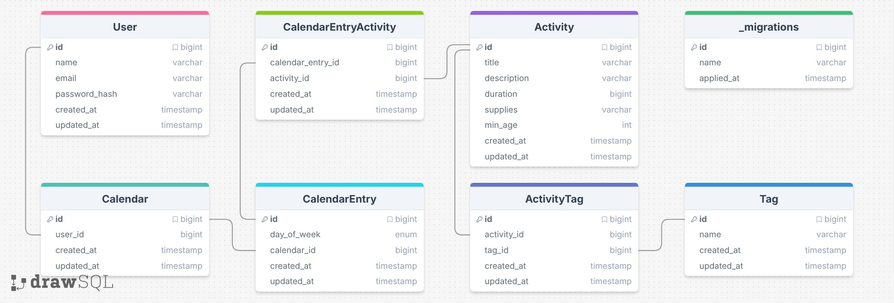

# Curious Toddlers
A website to help parents looking for activities, organization, and connection with other parents surrounding their child’s physical, mental, and emotional development

### Tech Stack

#### Frontend
- React
- Vite

#### Backend
- Javascript
- Express

#### Database
- mySQL

#### Version Control & CI/CD
- Git
- Github

#### Hosting
- Vercel
- DigitalOcean

### Feature planning
- Basic website setup, version control setup, user account flow (7 hours)
- Home Page, About Page (2 hours)
- Activity Repository Page (7 hours)
- Activity Calendar Page (12 hours)
- Learning about Montessori Page (2 hours)
- [BONUS] Parent-to-Parent Forum Page (10 hours)
- [BONUS] Child Development Journal Page (6 hours)
- [BONUS] Donations Page (10 hours)

### mySQL ERD

