# Curious Toddlers
A website to help parents looking for activities, organization, and connection with other parents surrounding their child’s physical, mental, and emotional development

### Tech Stack

#### Frontend
- React
- Vite

#### Backend
- Javascript
- Express

#### Database
- mySQL

#### Version Control & CI/CD
- Git
- Github

#### Hosting
- Vercel
- DigitalOcean

### Feature planning
- Basic website setup, version control setup, user account flow (7 hours)
- Home Page, About Page (2 hours)
- Activity Repository Page (7 hours)
- Activity Calendar Page (10 hours)
- Learning about Montessori Page (2 hours)
- Deployment (2 hours)
- [BONUS] Parent-to-Parent Forum Page (10 hours)
- [BONUS] Child Development Journal Page (6 hours)
- [BONUS] Donations Page (10 hours)

### mySQL ERD

### System Design

### Daily Goals
| Date        | Goal                      | Hours |
|-------------|---------------------------|------:|
| 03/26/26    | Initial designs | 1.5   |
| 03/27/26    | Initial project setup | 2   |
| 03/28/26    | Initial project setup | 2   |
| 03/30/26    | User account flow | 3   |
| 04/01/26    | Home page, about page | 2   |
| 04/02/26    | Activity repository page | 2   |
| 04/03/26    | Activity repository page | 2   |
| 04/04/26    | Activity repository page | 3   |
| 04/06/26    | Activity calendar page | 2   |
| 04/07/26    | Activity calendar page | 2   |
| 04/08/26    | Activity calendar page | 2   |
| 04/09/26    | Activity calendar page | 2   |
| 04/10/26    | Activity calendar page | 2   |
| 04/11/26    | Learning montessori page | 2   |
| 04/12/26    | Deployment | 2   |
| 04/13/26    | Present in class | -   |
| Total Hours |                           | 31.5   |
